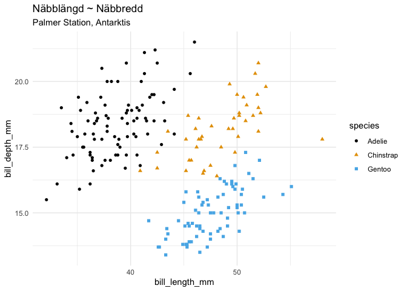

Det finns en uppsjö av sätt att bygga Machine Learning-modeller på. På
mina uppdrag, och inte minst under tiden som instruktör på vårt Data
Scientist-program, har jag stött på flera av dem. Många, som Sci-kit
Learn i Python och Caret är otroligt väl skriven mjukvara. Men gemensamt
för båda dessa paket, som sannolikt är de mest populära för Machine
Learning i open source-världen, är att de byggts bit efter bit. De har
utvecklats parallellt med att det de senaste 10 åren kommit många nya
idéer om hur man man bygger robusta ML-modeller. Paketen har byggts över
många iterationer och dessutom gjorts om flera gånger. Scikit-learn
började som ett projekt på Google Summercamp och Caret har utvecklats
för att passa hur man arbetade med non-clinical trials på Pfizer.

Mot den bakgrunden kändes det ganska rimligt när Max Kuhn, som ligger
bakom Caret, annonserade för några år sedan att de har börjat med en ny
samling paket för att göra Machine Learning i R. Samlingen heter
`tidymodels` och bygger på det populära syntaxet i paketsamlingen
`tidyverse`. `tidymodels` skiljer sig från `caret` och `scikit-learn`
framför allt genom att det bygger på en uppsättning paket istället för
ett paket som löser allt åt en. Det här kan tyckas motsägelsefullt,
borde det inte vara enklare att ha ett paket som gör allt åt oss? Men
Machine Learning är sällan så enkelt som det ibland framställs. Varje
ML-projekt har särskilda behov och ju mer paketerad en lösning är desto
svårare blir den att skräddarsy. Med tanke på hur många olika steg en
ML-process går igenom känns det rimligt att dela upp den och på så sätt
göra den mer modulär.

Paketen som ingår i `tidymodels` är:

    library(tidymodels)

    ## ── Attaching packages ────────────────────────────────────── tidymodels 0.1.0 ──

    ## ✓ broom     0.5.6      ✓ recipes   0.1.12
    ## ✓ dials     0.0.6      ✓ rsample   0.0.6 
    ## ✓ dplyr     1.0.0      ✓ tibble    3.0.1 
    ## ✓ ggplot2   3.3.2      ✓ tune      0.1.0 
    ## ✓ infer     0.5.1      ✓ workflows 0.1.1 
    ## ✓ parsnip   0.1.1      ✓ yardstick 0.0.6 
    ## ✓ purrr     0.3.4

    ## ── Conflicts ───────────────────────────────────────── tidymodels_conflicts() ──
    ## x purrr::discard()  masks scales::discard()
    ## x dplyr::filter()   masks stats::filter()
    ## x dplyr::lag()      masks stats::lag()
    ## x ggplot2::margin() masks dials::margin()
    ## x recipes::step()   masks stats::step()

-   `rsample` för att dela upp data i tränings- och test-data
-   `recipes` för *feature engineering*
-   `parsnip` för modellspecificering
-   `broom` för att göra modellobjekt till data.frames och tabeller
-   `infer` för statistisk inferens
-   `yardstick` för att modellprestanda
-   `dials` för att arbeta med
-   `tune` och `dials` för tuning av hyperparametrar
-   `workflows` för att enkelt kunna bygga ML-workflows

Förutom dessa ingår flera av `tidyverse`-paketen också, som `dplyr`,
`ggplot2`, `tibble` och `purrr`.

Det kanske låter som många paket, men det är inte alltid man använder
alla och ofta är det bara en eller två funktioner som man anropar.

Nog pratat, låt oss gå igenom ett exempel på hur det funkar.

Vi kan utgå från ett dataset som handlar om pingviner på Antarktis.
Målet med vår modell är att kunna prediktera pingvinart utifrån en
uppsättning variabler.

    knitr::include_graphics("lter_penguins.png")

Illustration och paket med pingvindata av Allison Horst:
<a href="https://github.com/allisonhorst/palmerpenguins" class="uri">https://github.com/allisonhorst/palmerpenguins</a>

Vi importerar data från paketet `palmerpenguins` som finns på Github.

    library(tidyverse)
    penguins <- na.omit(palmerpenguins::penguins)

    glimpse(penguins)

    ## Rows: 333
    ## Columns: 7
    ## $ species           <fct> Adelie, Adelie, Adelie, Adelie, Adelie, Adelie, Ade…
    ## $ island            <fct> Torgersen, Torgersen, Torgersen, Torgersen, Torgers…
    ## $ bill_length_mm    <dbl> 39.1, 39.5, 40.3, 36.7, 39.3, 38.9, 39.2, 41.1, 38.…
    ## $ bill_depth_mm     <dbl> 18.7, 17.4, 18.0, 19.3, 20.6, 17.8, 19.6, 17.6, 21.…
    ## $ flipper_length_mm <int> 181, 186, 195, 193, 190, 181, 195, 182, 191, 198, 1…
    ## $ body_mass_g       <int> 3750, 3800, 3250, 3450, 3650, 3625, 4675, 3200, 380…
    ## $ sex               <fct> male, female, female, female, male, female, male, f…

Det första vi gör i en Supervised Machine Learning, är att dela upp data
i tränings- och testdata. Idén är, som ni säkert vet, att slumpmässigt
ta bort en del av data och spara till sist i modelleringsprocessen för
att ha tillgång till “ny” okänd data när vi väl är klara med vår modell.
På så sätt får vi en ungefärlig uppfattning om hur modellen kommer att
prestera i produktion.

Förut brukade jag alltid visualisera och utforska all data innan själva
modelleringsprocessen började. Men eftersom poängen är att testdata ska
representera ny okänd data så har jag fått lära mig att det är klokt att
göra all explorativ analys endast på träningsdata.

För att dela upp data använder vi som sagt `rsample()`. Eftersom att
data är relativt välbalanserat och observationerna ganska få tar vi en
lite större del som test-data. Default-split är `0.75`.

    set.seed(523)
    penguin_split <- initial_split(penguins, prop = 0.6)

    penguin_split

    ## <Training/Validation/Total>
    ## <200/133/333>

För att göra vårt `split`-objekt till tränings och test-data använder vi
funktionerna `training()` respektive `testing()`.

    train <- training(penguin_split)
    test <- testing(penguin_split)

Visualiserar vi näbbredd och näbblängd i träningsdata så ser vi att de
är hyfsat distinkta per art.

    ggplot(train, aes(bill_length_mm, bill_depth_mm, color = species, shape = species)) +
      geom_point() +
      ggthemes::scale_color_colorblind() +
      theme_minimal() +
      labs(
        title = "Näbblängd ~ Näbbredd",
        subtitle = "Palmer Station, Antarktis"
      )

Nästa steg i en ML-process är generellt feature engineering. För att
göra det med `tidymodels` använder vi `recipes`.

Till att börja med specificerar vi ett “recept” d.v.s. hur vi vill
modellera. I det här fallet vill vi använda alla variabler för att
predicera `species`.

    recipe(species ~ ., data = train)

    ## Data Recipe
    ## 
    ## Inputs:
    ## 
    ##       role #variables
    ##    outcome          1
    ##  predictor          6

I anslutning till receptet vill man generellt göra vissa
transformeringar, i `recipes` heter dessa `step_...`, exempelvis:
`step_log()`, `step_BoxCox`, `step_naomit` osv.

När vi är klara med ett recept använder vi funktionen `prep` för att
preppa data.

    recept <- recipe(species ~ ., data = train) %>% 
      step_center(all_numeric(), -all_outcomes()) %>%
      step_scale(all_numeric(), -all_outcomes()) %>%
      prep()

För att få ut data från receptet använder vi funktionen `juice()`.

    train_recipe <- juice(recept)

    train_recipe

    ## # A tibble: 200 x 7
    ##    island bill_length_mm bill_depth_mm flipper_length_… body_mass_g sex  
    ##    <fct>           <dbl>         <dbl>            <dbl>       <dbl> <fct>
    ##  1 Torge…         -0.671        0.453            -0.397    -1.16    fema…
    ##  2 Torge…         -0.927        0.350            -1.39     -0.702   fema…
    ##  3 Torge…         -1.35         0.350            -1.10     -0.610   fema…
    ##  4 Torge…         -0.267        1.85             -0.255     0.378   male 
    ##  5 Torge…         -1.75         0.660            -1.17     -1.07    fema…
    ##  6 Torge…          0.374        2.26             -0.467     0.00756 male 
    ##  7 Biscoe         -1.13         0.608            -1.88     -0.980   fema…
    ##  8 Biscoe         -1.15         0.815            -1.46     -0.733   male 
    ##  9 Biscoe         -1.48         1.07             -0.820    -0.486   fema…
    ## 10 Biscoe         -0.946        0.0398           -1.46     -0.486   male 
    ## # … with 190 more rows, and 1 more variable: species <fct>

Vi är nu klara med *feature engineering* och vill träna en modell. Innan
vi gör själva träningen av modellen specificerar vi den med `parsnip`.

`parsnip` har stöd för de allra flesta typer av modell och man
specificerar vilken typ av modell man vill använda med exempelvis
`rand_forest()`, `linear_model()` eller `logistic_reg()`. Sedan
specificerar man *engine* med `set_engine()`. På så sätt kan man
specificera en modell men välja olika backends för hur den ska tränas.
Exempelvis om man vill använda två olika paket för en Random Forest
eller om man vill träna en regression första lokalt i R och sedan på ett
kluster via Spark.

Om vi dessutom vill tune:a en modell, alltså träna exempelvis en
randomforest med olika många träd, mtry osv så kan vi bara skriva
`trees = tune()` likt nedan, så kommer vi sedan kunna tune:a.

    rf <- rand_forest(trees = tune(), mode = "classification") %>% 
      set_engine("ranger")

    rf

    ## Random Forest Model Specification (classification)
    ## 
    ## Main Arguments:
    ##   trees = tune()
    ## 
    ## Computational engine: ranger

Men vill vi träna modellen i Spark kan vi bara ändra engine.

    rf_spark <- rand_forest(trees = tune(), mode = "classification") %>% 
      set_engine("spark")

    rf_spark

    ## Random Forest Model Specification (classification)
    ## 
    ## Main Arguments:
    ##   trees = tune()
    ## 
    ## Computational engine: spark

I nästa steg använder vi `workflow` för att specificera processen för
modelleringen. Vi lägger också till `set_args()` där vi säger att vi
vill tune:a `trees`.

    wf <- workflow() %>% 
      add_recipe(recept) %>% 
      add_model(rf)

Att skapa en 5-fold korsvalidering gör vi med `vfold_cv()` från
`rsample`.

    penguin_folds <- vfold_cv(train, 5)

    penguin_folds

    ## #  5-fold cross-validation 
    ## # A tibble: 5 x 2
    ##   splits           id   
    ##   <named list>     <chr>
    ## 1 <split [160/40]> Fold1
    ## 2 <split [160/40]> Fold2
    ## 3 <split [160/40]> Fold3
    ## 4 <split [160/40]> Fold4
    ## 5 <split [160/40]> Fold5

Nu har det blivit dags att tune:a modellen.

    hyper_parameters <- tune::tune_grid(wf, resamples = penguin_folds)

    collect_metrics(hyper_parameters)

    ## # A tibble: 20 x 6
    ##    trees .metric  .estimator  mean     n std_err
    ##    <int> <chr>    <chr>      <dbl> <int>   <dbl>
    ##  1   180 accuracy multiclass 0.96      5 0.0187 
    ##  2   180 roc_auc  hand_till  0.999     5 0.00117
    ##  3   236 accuracy multiclass 0.96      5 0.0187 
    ##  4   236 roc_auc  hand_till  0.996     5 0.00287
    ##  5   503 accuracy multiclass 0.97      5 0.0146 
    ##  6   503 roc_auc  hand_till  0.998     5 0.00118
    ##  7   770 accuracy multiclass 0.965     5 0.0150 
    ##  8   770 roc_auc  hand_till  0.998     5 0.00117
    ##  9   890 accuracy multiclass 0.965     5 0.0150 
    ## 10   890 roc_auc  hand_till  0.997     5 0.00229
    ## 11  1011 accuracy multiclass 0.965     5 0.0150 
    ## 12  1011 roc_auc  hand_till  0.997     5 0.00258
    ## 13  1334 accuracy multiclass 0.96      5 0.0187 
    ## 14  1334 roc_auc  hand_till  0.996     5 0.00346
    ## 15  1436 accuracy multiclass 0.965     5 0.0150 
    ## 16  1436 roc_auc  hand_till  0.997     5 0.00235
    ## 17  1753 accuracy multiclass 0.965     5 0.0150 
    ## 18  1753 roc_auc  hand_till  0.995     5 0.00432
    ## 19  1991 accuracy multiclass 0.965     5 0.0150 
    ## 20  1991 roc_auc  hand_till  0.997     5 0.00326

Vi kan enkelt extrahera den bästa modellen med `select_best()`.

    best_hp <- select_best(hyper_parameters, metric = "roc_auc")

    best_hp

    ## # A tibble: 1 x 1
    ##   trees
    ##   <int>
    ## 1   180

    best_workflow <- tune::finalize_workflow(wf, best_hp)

    best_workflow

    ## ══ Workflow ════════════════════════════════════════════════════════════════════
    ## Preprocessor: Recipe
    ## Model: rand_forest()
    ## 
    ## ── Preprocessor ────────────────────────────────────────────────────────────────
    ## 2 Recipe Steps
    ## 
    ## ● step_center()
    ## ● step_scale()
    ## 
    ## ── Model ───────────────────────────────────────────────────────────────────────
    ## Random Forest Model Specification (classification)
    ## 
    ## Main Arguments:
    ##   trees = 180
    ## 
    ## Computational engine: ranger

När vi nu tränar modellen gör vi det på varje fold för att sedan
predicera nästa fold. På så sätt kan vi räkna ut träffsäkerhet utan att
behöva använda oss av test-data.

I `fit_resamples()` kan vi också specificera våra accuracy-metrics.

    set.seed(234)
    rf_res <- best_workflow %>%
        fit_resamples(
            penguin_folds,
            metrics = metric_set(roc_auc, accuracy, precision, f_meas),
            control = control_resamples(save_pred = TRUE)
        )

För att få ut våra prestandamått använder vi bara `collect_metrics()`.

    collect_metrics(rf_res)

    ## # A tibble: 4 x 5
    ##   .metric   .estimator  mean     n std_err
    ##   <chr>     <chr>      <dbl> <int>   <dbl>
    ## 1 accuracy  multiclass 0.96      5 0.0187 
    ## 2 f_meas    macro      0.939     5 0.0313 
    ## 3 precision macro      0.946     5 0.0353 
    ## 4 roc_auc   hand_till  0.997     5 0.00296

Det sista vi gör är att träna modellen på all data och se hur den
presterar på test-data. Det gör vi med funktionen `last_fit()`.

    final_fit <- last_fit(object = best_workflow,
                          split = penguin_split,
                          metrics = metric_set(roc_auc, accuracy, precision, f_meas))

    collect_metrics(final_fit)

    ## # A tibble: 4 x 3
    ##   .metric   .estimator .estimate
    ##   <chr>     <chr>          <dbl>
    ## 1 accuracy  multiclass     0.985
    ## 2 precision macro          0.982
    ## 3 f_meas    macro          0.982
    ## 4 roc_auc   hand_till      1.00

Till sist tränar vi modellen på all data och extraherar den till ett
modellobjekt. Detta kan vi sedan använda för att sätta modellen i
produktion.

    best_model <- extract_model(fit(best_workflow, penguins))

    best_model

    ## Ranger result
    ## 
    ## Call:
    ##  ranger::ranger(formula = formula, data = data, num.trees = ~180L,      num.threads = 1, verbose = FALSE, seed = sample.int(10^5,          1), probability = TRUE) 
    ## 
    ## Type:                             Probability estimation 
    ## Number of trees:                  180 
    ## Sample size:                      333 
    ## Number of independent variables:  6 
    ## Mtry:                             2 
    ## Target node size:                 10 
    ## Variable importance mode:         none 
    ## Splitrule:                        gini 
    ## OOB prediction error (Brier s.):  0.01734104
